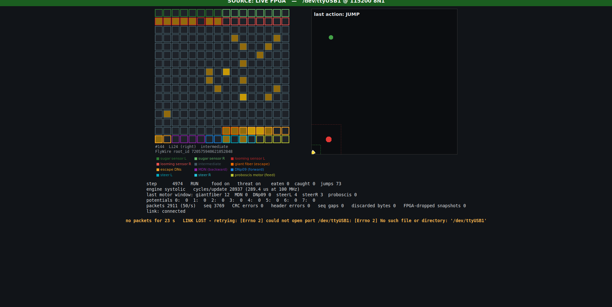

# Systolic Neural Accelerator on FPGA: a FlyWire fruit-fly circuit on a Basys 3

A parameterized **systolic matrix-vector accelerator** in SystemVerilog runs a **256-neuron subcircuit of the real fruit-fly brain connectome** ([FlyWire](https://flywire.ai), FAFB v783) on a Digilent Basys 3 (Artix-7). The network controls a virtual fly in closed loop:

- **Food:** sugar-taste neurons drive proboscis motor neurons, and the fly eats.
- **Threat:** looming detectors drive the giant fiber, and the fly jumps away.

The FPGA streams its state over USB to a live dashboard.



*Live capture from the board: the 256 FlyWire neurons (left), with the fly escaping a threat (right). It reported 28,937 cycles per neural update and 0 CRC errors.*

## Highlights

| | |
|---|---|
| Accelerator | Weight-stationary systolic array (2×2 / 4×4 / 8×8 configurable), signed INT8 weights, 32-bit accumulators, banked weight memory, double-buffered weight tiles; serial MAC baseline with the same interface |
| Network | 256 neurons and 2,265 signed synapses taken from FlyWire. Weight = sign(transmitter) × min(127, 2 × synapse count). No per-synapse tuning. |
| Neuron model | Integer leaky integrate-and-fire with double-buffered state (no same-step spike contamination) |
| Board | Basys 3, 100 MHz, single clock domain. Switches/buttons for food, threat, pause and step; UART telemetry (119-byte CRC-checked packets, 50/s) |
| Verification | Python reference model. Self-checking testbenches with bit-exact 700-step closed-loop traces, random-stimulus world test, SystemVerilog assertions, UVM environment with functional coverage, and 27 injected-bug mutation checks (all detected). |

### Results (Vivado 2025.2, xc7a35tcpg236-1, post-route)

| Design | LUT | FF | DSP | BRAM tiles | Setup / hold slack | Cycles per neural update | Time |
|---|---|---|---|---|---|---|---|
| Full design, 4×4 systolic (banked, 2 weight buffers) | 3,430 | 3,681 | 16 | 32 | +0.157 / +0.040 ns | **28,937** | 289 µs |
| Serial baseline (simulation cycles) | | | 5 | | | 65,799 | 658 µs |

- **Speedup:** the 4×4 systolic engine is about **2.3× faster** than the serial baseline per 256-neuron update, at the same 100 MHz clock.
- **Accelerator benchmarks:** standalone runs for every array configuration are in [`reports/impl/results.md`](reports/impl/results.md), with cycle counts in [`reports/perf/mvu_cycles.md`](reports/perf/mvu_cycles.md).
- **Not yet rebuilt:** the full-design serial implementation in `results.md` is still from the earlier 64-neuron version.

### Behavior (reference model, 40 trials each, [`model/flywire/out/behavior_report.md`](model/flywire/out/behavior_report.md))

| Scenario | FlyWire circuit | All synapses removed |
|---|---|---|
| Food placed ahead: fly eats | 35/40 | 0/40 |
| Threat placed beside it: fly escapes | 39/40 | 29/40 |

## Status

| Stage | State |
|---|---|
| RTL implemented | done |
| Simulated (Icarus, Verilator, Vivado XSim) | done; [regression summary](reports/regression/summary.md) |
| Synthesized, timing met at 100 MHz | done |
| Running on the board with the live dashboard | done |
| Known limitations | see below |

## Repository layout

```
rtl/          SystemVerilog design
  core/         systolic PE/array, weight memory, systolic and serial matrix-vector units
  neural/       LIF neuron (single-cycle + pipelined), fly world, neural core
  uart/ board/  telemetry, UART, input conditioning, Basys 3 top
  common/       generated config package + FlyWire weight ROM
tb/           unit, integration, SVA and UVM testbenches
model/        Python reference model, vector generators, FlyWire circuit extraction
dashboard/    live / offline / replay dashboard (Tkinter)
scripts/      regression, Vivado build/program/project scripts, XSim runner, demo launcher
constraints/  Basys 3 XDC
docs/         specification, FlyWire notes, verification plan, architecture, setup steps
reports/      selected regression, implementation and performance results
```

## Running it

Full steps are in [`docs/setup_and_run.md`](docs/setup_and_run.md). In short, with Vivado 2025.2 in WSL/Linux:

```bash
bash scripts/setup_python.sh                                           # dashboard environment
bash scripts/vivado/xsim_run.sh directed                               # XSim test suite
bash scripts/vivado/run_vivado.sh build sys4x4_banked_wbuf2 top        # bitstream
bash scripts/demo.sh                                                   # program the board and open the dashboard
python3 scripts/run_regression.py --mutants                            # open-source regression (Icarus/Verilator)
vivado -mode batch -source scripts/vivado/create_project.tcl           # optional Vivado GUI project
```

No board? `.venv/bin/python dashboard/fly_dashboard.py --offline` runs the reference model, labelled clearly as offline, not FPGA output.

## What is and isn't biology

The connectivity (which neurons, synapse counts, excitatory/inhibitory sign) comes from FlyWire. Everything else is a modelling choice, documented in [`docs/flywire.md`](docs/flywire.md):

- integer LIF neurons and one global weight gain
- the 256-neuron selection method
- the virtual world, including default forward walking and the pursuing threat

The subcircuit keeps only about 10% of each neuron's real inputs. This is an engineering demonstration, not a validated model of fly behavior.

## Known limitations

- The fly can get trapped in an arena corner while the threat sits next to it: every jump direction is blocked by walls. This is a world-rule limitation.
- The design is volatile: it must be reprogrammed after power-off (booting from the on-board flash isn't set up yet).
- Setup slack is thin (+0.157 ns). The critical path is the threat-distance sensor calculation.

## Data and credits

Connectome data: FlyWire Consortium. Dorkenwald et al., *Neuronal wiring diagram of an adult brain*, Nature 2024; Schlegel et al., *Whole-brain annotation and multi-connectome cell typing of Drosophila*, Nature 2024. Used under the FlyWire citation guidelines. The raw downloads are not included (see `docs/flywire.md` to re-download); the derived 256-neuron subset is in `model/flywire/out/`.

Author: Dat Le, Electrical Engineering, Bucknell University.
